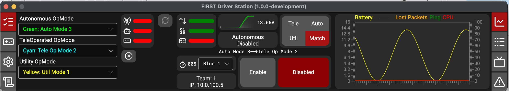

# OpMode Framework

The OpMode framework is a robot code structure where each mode of operation (autonomous, teleoperated, utility) is represented by its own class. The Driver Station displays a drop-down list of the available opmodes for each mode, letting operators select routines before enabling the robot.



The OpMode framework is the recommended starting point for new teams. Teams already using ``TimedRobot`` can continue to do so; the two approaches coexist in WPILib.

## The Robot Class

In an opmode project the ``Robot`` class extends ``OpModeRobot`` ([Java](https://github.wpilib.org/allwpilib/docs/beta/java/org/wpilib/framework/OpModeRobot.html), [C++](https://github.wpilib.org/allwpilib/docs/beta/cpp/classwpi_1_1_op_mode_robot_base.html)) instead of ``TimedRobot``. Hardware objects, subsystems, and any state shared across all opmodes are declared as members here, exactly as they would be in a ``TimedRobot`` project.

.. tab-set::

   .. tab-item:: Java
      :sync: Java

      .. rli:: https://raw.githubusercontent.com/wpilibsuite/allwpilib/v2027.0.0-alpha-6/wpilibjExamples/src/main/java/org/wpilib/templates/opmode/Robot.java
         :language: java

   .. tab-item:: C++ (Header)
      :sync: C++ (Header)

      .. rli:: https://raw.githubusercontent.com/wpilibsuite/allwpilib/v2027.0.0-alpha-6/wpilibcExamples/src/main/cpp/templates/opmode/include/Robot.hpp
         :language: c++

   .. tab-item:: C++ (Source)
      :sync: C++ (Source)

      .. rli:: https://raw.githubusercontent.com/wpilibsuite/allwpilib/v2027.0.0-alpha-6/wpilibcExamples/src/main/cpp/templates/opmode/cpp/Robot.cpp
         :language: c++

``OpModeRobot`` provides several overrideable lifecycle methods for robot-wide behavior:

- ``driverStationConnected()`` — called once when the Driver Station first connects
- ``robotPeriodic()`` — called every loop iteration regardless of enabled state or selected opmode
- ``disabledInit()`` / ``disabledPeriodic()`` / ``disabledExit()`` — called when entering, during, and exiting disabled state
- ``nonePeriodic()`` — called periodically when no opmode is selected (including when the DS is disconnected)
- ``simulationInit()`` / ``simulationPeriodic()`` — called during simulation

## Creating OpModes

Individual opmodes extend ``PeriodicOpMode`` ([Java](https://github.wpilib.org/allwpilib/docs/beta/java/org/wpilib/opmode/PeriodicOpMode.html), [C++](https://github.wpilib.org/allwpilib/docs/beta/cpp/classwpi_1_1_periodic_op_mode.html)) and implement whichever lifecycle methods they need.

.. tab-set::

   .. tab-item:: Java
      :sync: Java

      In Java, opmodes are registered by annotating the class with ``@Autonomous``, ``@Teleop``, or ``@Utility``. ``OpModeRobot`` automatically scans the project package at startup and publishes the list to the Driver Station.

      .. tab-set::

         .. tab-item:: MyTeleop.java

            .. rli:: https://raw.githubusercontent.com/wpilibsuite/allwpilib/v2027.0.0-alpha-6/wpilibjExamples/src/main/java/org/wpilib/templates/opmode/opmode/MyTeleop.java
               :language: java

         .. tab-item:: MyAuto.java

            .. rli:: https://raw.githubusercontent.com/wpilibsuite/allwpilib/v2027.0.0-alpha-6/wpilibjExamples/src/main/java/org/wpilib/templates/opmode/opmode/MyAuto.java
               :language: java

      All annotation attributes are optional:

      .. list-table::
         :header-rows: 1

         * - Attribute
           - Description
           - Default
         * - ``name``
           - Name shown in the DS drop-down
           - Class simple name
         * - ``group``
           - Group label for organizing the drop-down
           - (ungrouped)
         * - ``description``
           - Extended description
           - (none)
         * - ``textColor``
           - Text color in the DS (CSS color string)
           - (default)
         * - ``backgroundColor``
           - Background color in the DS (CSS color string)
           - (default)

      A class can carry multiple annotations to appear in more than one mode list:

      .. code-block:: java

         @Autonomous
         @Teleop(name = "Test Drive")
         public class DriveStraight extends PeriodicOpMode { ... }

   .. tab-item:: C++
      :sync: C++

      C++ has no annotation support. Opmodes are registered explicitly in the ``Robot`` constructor using ``AddOpMode<T>(mode, name, group, description)``, followed by a single ``PublishOpModes()`` call.

      .. tab-set::

         .. tab-item:: Robot.cpp

            .. rli:: https://raw.githubusercontent.com/wpilibsuite/allwpilib/v2027.0.0-alpha-6/wpilibcExamples/src/main/cpp/templates/opmode/cpp/Robot.cpp
               :language: c++

         .. tab-item:: MyTeleop.hpp

            .. rli:: https://raw.githubusercontent.com/wpilibsuite/allwpilib/v2027.0.0-alpha-6/wpilibcExamples/src/main/cpp/templates/opmode/include/opmode/MyTeleop.hpp
               :language: c++

         .. tab-item:: MyTeleop.cpp

            .. rli:: https://raw.githubusercontent.com/wpilibsuite/allwpilib/v2027.0.0-alpha-6/wpilibcExamples/src/main/cpp/templates/opmode/cpp/opmode/MyTeleop.cpp
               :language: c++

         .. tab-item:: MyAuto.hpp

            .. rli:: https://raw.githubusercontent.com/wpilibsuite/allwpilib/v2027.0.0-alpha-6/wpilibcExamples/src/main/cpp/templates/opmode/include/opmode/MyAuto.hpp
               :language: c++

         .. tab-item:: MyAuto.cpp

            .. rli:: https://raw.githubusercontent.com/wpilibsuite/allwpilib/v2027.0.0-alpha-6/wpilibcExamples/src/main/cpp/templates/opmode/cpp/opmode/MyAuto.cpp
               :language: c++

## OpMode Lifecycle

**When the operator selects an opmode on the Driver Station**, a new instance of the opmode class is constructed. This is a fresh object — any state can be initialized in the constructor.

**While an opmode is selected but the robot is disabled**, ``disabledPeriodic()`` is called regularly at ``OpModeRobot#getPeriod()``. This is useful for updating dashboard displays, reading sensors, or previewing what the opmode is about to do. The library guarantees that ``disabledPeriodic()`` will be called at least once before the robot transitions to enabled, so any initialization logic placed here is guaranteed to run.

**When the robot transitions from disabled to enabled**, ``start()`` is called exactly once.

**While the robot is enabled**, ``periodic()`` is called repeatedly at ``OpModeRobot#getPeriod()`` (default 20 ms). Additional callbacks registered via ``addPeriodic()`` run at their own configured rates.

**When the robot disables or a different opmode is selected while enabled**, ``end()`` is called first, then ``close()`` (Java) or the object is destroyed (C++/Python). The object is never reused.

.. note:: Selecting a different opmode while the robot is enabled automatically disables the robot first, so ``end()`` is always called before the switch.

**If a different opmode is selected while the robot is already disabled**, ``close()`` is called (or the object is destroyed) with no ``end()`` call, since the opmode was never enabled.

After the old opmode is closed, a fresh opmode object is constructed based on the current DS selection. In teleop, autonomous, and utility modes the drop-down stays the same, so the same class is typically constructed again. In match mode (or when FMS-connected), only the selected autonomous opmode is constructed initially; once autonomous completes, the selected teleop opmode object is then constructed. Only one opmode object is ever alive at a time.

## Accessing Robot Hardware

Opmodes receive the ``Robot`` instance through their constructor. The library detects a single-argument constructor that accepts the ``Robot`` type and calls it automatically, passing the ``Robot`` object. If no such constructor exists, the no-argument constructor is used instead.

.. tab-set::

   .. tab-item:: Java
      :sync: Java

      ```java
      @Teleop
      public class MyTeleop extends PeriodicOpMode {
        private final Robot robot;

        public MyTeleop(Robot robot) {  // Robot is injected automatically
          this.robot = robot;
        }

        @Override
        public void periodic() {
          robot.drive.arcadeDrive(robot.joystick.getY(), robot.joystick.getX());
        }
      }
      ```

   .. tab-item:: C++ (Header)
      :sync: C++ (Header)

      ```c++
      class MyTeleop : public wpi::PeriodicOpMode {
       public:
        explicit MyTeleop(Robot& robot);  // Robot is injected automatically
        void Periodic() override;
       private:
        Robot& robot;
      };
      ```

   .. tab-item:: C++ (Source)
      :sync: C++ (Source)

      ```c++
      MyTeleop::MyTeleop(Robot& robot) : robot{robot} {}

      void MyTeleop::Periodic() {
        robot.drive.ArcadeDrive(robot.joystick.GetY(), robot.joystick.GetX());
      }
      ```

## Multiple OpModes and DS Selection

Any number of classes can be annotated with the same type. All of them appear in the Driver Station's drop-down for that mode, organized alphabetically within their groups.

```java
@Autonomous(name = "Drive Straight", group = "Drive")
public class DriveStraight extends PeriodicOpMode { ... }

@Autonomous(name = "Score Cone", group = "Score")
public class ScoreCone extends PeriodicOpMode { ... }

@Autonomous(name = "Score Cube", group = "Score")
public class ScoreCube extends PeriodicOpMode { ... }
```

The operator selects the desired routine in the DS before enabling. In match mode and while connected to the FMS, the operator selects both an autonomous and a teleop opmode. The driver station will automatically send the autonomous selection to the robot at the start of the match, and then send the teleop selection when autonomous ends.

## Custom Periodic Callbacks

``PeriodicOpMode`` has an additional method, ``addPeriodic()``, allowing callbacks to run at rates different from the main loop:

.. tab-set::

   .. tab-item:: Java
      :sync: Java

      ```java
      public class MyAuto extends PeriodicOpMode {
        public MyAuto(Robot robot) {
          // Run an odometry update at 5 ms, offset 1 ms from the main loop
          addPeriodic(robot.odometry::update, 0.005, 0.001);
        }
      }
      ```

   .. tab-item:: C++ (Source)
      :sync: C++ (Source)

      ```c++
      MyAuto::MyAuto(Robot& robot) : robot{robot} {
        // Run an odometry update at 5 ms, offset 1 ms from the main loop
        AddPeriodic([&] { robot.odometry.Update(); }, 5_ms, 1_ms);
      }
      ```

Callbacks are registered immediately at opmode construction and run even while the robot is disabled.

## Migration from TimedRobot

Teams switching from ``TimedRobot`` to ``OpModeRobot``:

- Replace per-mode methods in ``Robot`` (``autonomousInit``, ``teleopPeriodic``, etc.) with separate ``@Autonomous`` and ``@Teleop`` opmode classes.
- Replace ``SendableChooser`` with multiple ``@Autonomous`` classes.
- Replace ``utilityInit``/``utilityPeriodic`` with ``@Utility`` opmode classes.


``TimedRobot`` remains fully supported. Migration is not required.
