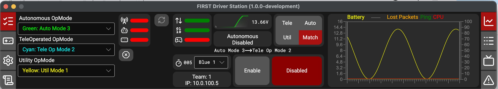

# OpMode Framework

## What is an OpMode?

An opmode is an operator-selectable program that defines what the robot does during a particular mode of operation (autonomous, teleoperated, or utility).

Common use cases include:

- Multiple autonomous routines: follow different paths or perform different actions depending on match strategy
- Multiple teleoperated behaviors: switch between drive styles (e.g. tank vs. arcade), different button mappings, or restricted controls for robot demonstrations or guest drivers
- Testing and diagnostics: test the whole robot, an individual subsystem, a motor, or a sensor without modifying match code

You can select an autonomous, teleop, or utility opmode directly on the DS, or use match mode to select both an autonomous and teleop opmode with match timing.

Here's an example of what opmode selection looks like on the Driver Station:



## The Robot Class

In an opmode project the ``Robot`` class extends ``OpModeRobot`` ([Java](https://github.wpilib.org/allwpilib/docs/beta/java/org/wpilib/framework/OpModeRobot.html), [C++](https://github.wpilib.org/allwpilib/docs/beta/cpp/classwpi_1_1_op_mode_robot_base.html)). Hardware objects, subsystems, and any state shared across all opmodes are declared as members here.

.. tab-set::

   .. tab-item:: Java
      :sync: Java

      .. rli:: https://raw.githubusercontent.com/wpilibsuite/allwpilib/v2027.0.0-alpha-6/wpilibjExamples/src/main/java/org/wpilib/templates/opmode/Robot.java
         :language: java
         :lines: 5-33
         :lineno-match:

   .. tab-item:: C++ (Header)
      :sync: C++ (Header)

      .. rli:: https://raw.githubusercontent.com/wpilibsuite/allwpilib/v2027.0.0-alpha-6/wpilibcExamples/src/main/cpp/templates/opmode/include/Robot.hpp
         :language: c++
         :lines: 5-14
         :lineno-match:

   .. tab-item:: C++ (Source)
      :sync: C++ (Source)

      .. rli:: https://raw.githubusercontent.com/wpilibsuite/allwpilib/v2027.0.0-alpha-6/wpilibcExamples/src/main/cpp/templates/opmode/cpp/Robot.cpp
         :language: c++
         :lines: 5-25
         :lineno-match:

The following methods in ``OpModeRobot`` run no matter the selected opmode:

- ``driverStationConnected()``: called once when the Driver Station first connects
- ``robotPeriodic()``: called every loop iteration regardless of enabled state or selected opmode
- ``disabledInit()`` / ``disabledPeriodic()`` / ``disabledExit()``: called when entering, during, and exiting the disabled state. The robot is disabled whenever the DS has not enabled it or communication is lost; while disabled, actuators (motors, solenoids, etc.) cannot be commanded.
- ``nonePeriodic()``: called periodically when no opmode is selected (including when the DS is disconnected)
- ``simulationInit()`` / ``simulationPeriodic()``: called during construction and every loop if simulation is running

## Creating OpModes

Individual opmodes extend ``PeriodicOpMode`` ([Java](https://github.wpilib.org/allwpilib/docs/beta/java/org/wpilib/opmode/PeriodicOpMode.html), [C++](https://github.wpilib.org/allwpilib/docs/beta/cpp/classwpi_1_1_periodic_op_mode.html)) and implement whichever lifecycle methods they need.

.. tab-set::

   .. tab-item:: Java
      :sync: Java

      In Java, opmodes are registered by annotating the class with ``@Autonomous``, ``@Teleop``, or ``@Utility``. ``OpModeRobot`` automatically scans the project package at startup and publishes the list to the Driver Station.

      .. tab-set::

         .. tab-item:: MyTeleop.java

            .. rli:: https://raw.githubusercontent.com/wpilibsuite/allwpilib/v2027.0.0-alpha-6/wpilibjExamples/src/main/java/org/wpilib/templates/opmode/opmode/MyTeleop.java
               :language: java
               :lines: 5-44
               :lineno-match:

         .. tab-item:: MyAuto.java

            .. rli:: https://raw.githubusercontent.com/wpilibsuite/allwpilib/v2027.0.0-alpha-6/wpilibjExamples/src/main/java/org/wpilib/templates/opmode/opmode/MyAuto.java
               :language: java
               :lines: 5-30
               :lineno-match:

      All annotation attributes are optional:

      .. list-table::
         :header-rows: 1

         * - Attribute
           - Description
           - Default
         * - ``name``
           - Name shown in the DS drop-down
           - Class simple name
         * - ``group``
           - Group label for organizing the drop-down
           - (ungrouped)
         * - ``description``
           - Extended description
           - (none)
         * - ``textColor``
           - Text color in the DS (CSS color string)
           - (default)
         * - ``backgroundColor``
           - Background color in the DS (CSS color string)
           - (default)

   .. tab-item:: C++
      :sync: C++

      C++ has no annotation support. Opmodes are registered explicitly in the ``Robot`` constructor using ``AddOpMode<T>(mode, name, group, description)``, followed by a single ``PublishOpModes()`` call.

      .. tab-set::

         .. tab-item:: Robot.cpp

            .. rli:: https://raw.githubusercontent.com/wpilibsuite/allwpilib/v2027.0.0-alpha-6/wpilibcExamples/src/main/cpp/templates/opmode/cpp/Robot.cpp
               :language: c++
               :lines: 5-25
               :lineno-match:

         .. tab-item:: MyTeleop.hpp

            .. rli:: https://raw.githubusercontent.com/wpilibsuite/allwpilib/v2027.0.0-alpha-6/wpilibcExamples/src/main/cpp/templates/opmode/include/opmode/MyTeleop.hpp
               :language: c++
               :lines: 5-23
               :lineno-match:

         .. tab-item:: MyTeleop.cpp

            .. rli:: https://raw.githubusercontent.com/wpilibsuite/allwpilib/v2027.0.0-alpha-6/wpilibcExamples/src/main/cpp/templates/opmode/cpp/opmode/MyTeleop.cpp
               :language: c++
               :lines: 5-26
               :lineno-match:

         .. tab-item:: MyAuto.hpp

            .. rli:: https://raw.githubusercontent.com/wpilibsuite/allwpilib/v2027.0.0-alpha-6/wpilibcExamples/src/main/cpp/templates/opmode/include/opmode/MyAuto.hpp
               :language: c++
               :lines: 5-23
               :lineno-match:

         .. tab-item:: MyAuto.cpp

            .. rli:: https://raw.githubusercontent.com/wpilibsuite/allwpilib/v2027.0.0-alpha-6/wpilibcExamples/src/main/cpp/templates/opmode/cpp/opmode/MyAuto.cpp
               :language: c++
               :lines: 5-33
               :lineno-match:

## OpMode Lifecycle

**When the operator selects an opmode on the Driver Station**, a new instance of the opmode class is constructed. There is no separate initialization function; any necessary state and hardware setup can happen in the constructor directly.

**While an opmode is selected but the robot is disabled**, ``disabledPeriodic()`` is called periodically at ``OpModeRobot#getPeriod()`` (default 20 ms). This is useful for updating dashboard displays, reading sensors, or previewing what the opmode is about to do. The library guarantees that ``disabledPeriodic()`` will be called at least once before the robot transitions to enabled, so any initialization logic placed here is guaranteed to run.

**When the robot transitions from disabled to enabled**, ``start()`` is called exactly once. Use it to start timers, reset accumulators, or prepare anything that needs to be fresh at the start of each enable. ``start()`` should return quickly and not have any blocking actions; ongoing work belongs in ``periodic()``.

**While the robot is enabled**, ``periodic()`` is called repeatedly at ``OpModeRobot#getPeriod()`` (default 20 ms / 50 Hz). This is where most robot logic runs: reading sensors, computing outputs, and commanding actuators. Additional callbacks registered with ``addPeriodic()`` run at their own configured rates.

**When the robot disables**, ``end()`` is called first. Use it to stop motors, retract mechanisms, or send any final state updates. Then ``close()`` is called (Java) or the object is destroyed (C++/Python); use ``close()`` to release resources like open file handles. The object is never reused after this point.

.. note:: Selecting a different opmode while the robot is enabled automatically disables the robot first, so ``end()`` is always called before the switch.

**If a different opmode is selected while the robot is already disabled**, only ``close()`` is called, as the opmode was never started.

Immediately after the old opmode is destroyed, a fresh instance is constructed based on the current DS selection. If the same opmode is still selected, the same class is instantiated again from scratch, so its constructor and ``disabledPeriodic()`` run again before the next enable. In match mode (when selected manually on the DS or when FMS-connected), only the selected autonomous opmode is constructed initially; once autonomous completes, the selected teleop opmode is then constructed. Only one opmode object is ever alive at a time.

## Accessing Robot Hardware

Opmodes receive the ``Robot`` instance through their constructor. Declare a field to store it and assign it in the constructor so all methods can use it.

.. tab-set::

   .. tab-item:: Java
      :sync: Java

      ```java
      @Teleop
      public class MyTeleop extends PeriodicOpMode {
        private final Robot robot;

        public MyTeleop(Robot robot) {  // Robot is injected automatically
          this.robot = robot;
        }

        @Override
        public void periodic() {
          robot.drive.arcadeDrive(robot.joystick.getY(), robot.joystick.getX());
        }
      }
      ```

   .. tab-item:: C++ (Header)
      :sync: C++ (Header)

      ```c++
      class MyTeleop : public wpi::PeriodicOpMode {
       public:
        explicit MyTeleop(Robot& robot);  // Robot is injected automatically
        void Periodic() override;
       private:
        Robot& robot;
      };
      ```

   .. tab-item:: C++ (Source)
      :sync: C++ (Source)

      ```c++
      MyTeleop::MyTeleop(Robot& robot) : robot{robot} {}

      void MyTeleop::Periodic() {
        robot.drive.ArcadeDrive(robot.joystick.GetY(), robot.joystick.GetX());
      }
      ```

## Multiple OpModes and DS Selection

Any number of classes can be annotated with the same type. All of them appear in the Driver Station's drop-down for that mode, organized alphabetically within their groups.

```java
@Autonomous(name = "Drive Straight", group = "Drive")
public class DriveStraight extends PeriodicOpMode { ... }

@Autonomous(name = "Score Cone", group = "Score")
public class ScoreCone extends PeriodicOpMode { ... }

@Autonomous(name = "Score Cube", group = "Score")
public class ScoreCube extends PeriodicOpMode { ... }
```

The operator selects the desired OpMode in the DS before enabling. In match mode (selected manually in the DS, or when connected to the FMS), the operator selects both an autonomous and a teleop OpMode before the match; the DS transitions between them automatically.

## Custom Periodic Callbacks

``PeriodicOpMode`` has an additional method, ``addPeriodic()``, for running callbacks at rates other than the main loop period. This is useful when a task needs to run more frequently than 20 ms, such as high-rate odometry integration or sensor polling. The optional offset parameter staggers the callback relative to the start of the main loop, which prevents it from executing at the exact same moment as ``periodic()`` and ensures the most recent sensor data is available when ``periodic()`` runs:

.. tab-set::

   .. tab-item:: Java
      :sync: Java

      ```java
      public class MyAuto extends PeriodicOpMode {
        public MyAuto(Robot robot) {
          // Run an odometry update at 5 ms, offset 1 ms from the main loop
          addPeriodic(robot.odometry::update, 0.005, 0.001);
        }
      }
      ```

   .. tab-item:: C++ (Source)
      :sync: C++ (Source)

      ```c++
      MyAuto::MyAuto(Robot& robot) : robot{robot} {
        // Run an odometry update at 5 ms, offset 1 ms from the main loop
        AddPeriodic([&] { robot.odometry.Update(); }, 5_ms, 1_ms);
      }
      ```

Callbacks are registered immediately at opmode construction and run even while the robot is disabled.

.. warning:: Callbacks run regardless of enabled state. Any actuator commands inside a callback must be guarded with an ``isEnabled()`` check, or they will silently have no effect while the robot is disabled.

## Migration from TimedRobot

To switch to the OpMode framework from TimedRobot, replace per-mode methods in ``Robot`` (``autonomousInit``, ``teleopPeriodic``, ``utilityInit``, ``utilityPeriodic`` etc.) with separate ``@Autonomous``, ``@Teleop``, and ``@Utility`` opmode classes. Multiple opmodes of the same type replace ``SendableChooser``.

``TimedRobot`` remains fully supported. Migration is not required.
