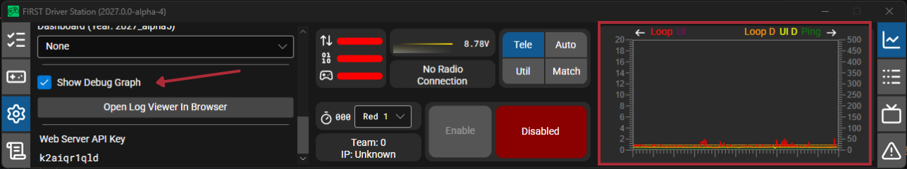
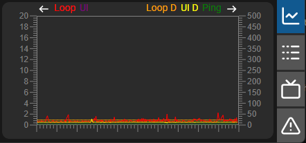

# Driver Station Debug Graph

The FIRST Driver Station has a a new window to help diagnose robot control issues.

## Opening Debug Graph

To show the debug graph, select the gear icon for the settings tab and select ``Show Debug Graph``, the debug graph will replace the default graph on the graph tab.

## Viewing Debug Graph

The Debug Graph shows the timing of the driver station control-loops, UI loops, and ping, as shown below. When the Driver Station and Robot Controller are operating as expected, the graph should show generally low and consistant values, potentially with occasional spikes.

1. Control-loop Runtime (Red) - displays the time each control loop takes in microseconds.
2. UI loop runtime (Purple) - displays the time each UI loop takes in microseconds.
3. Control-loop period (Orange) - displays the time between the start of each consecutive control-loop.
4. UI loop period (Yellow) - displays the time between the start of each consecutive UI loop.
5. Ping (Green) - displays the communication time between the Driver Station and Robot Controller.
