.. include:: <isonum.txt>

# FIRST Driver Station Introduction

This article describes the use and features of the FIRST\ |reg| Driver Station.

For information on installing the Driver Station software see :doc:`/docs/zero-to-robot/step-2/first-driver-station-installation`.

## Starting the FIRST Driver Station

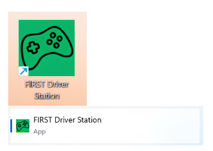

The FIRST Driver Station can be launched by double-clicking the icon on the Desktop or by selecting Start->All Apps->FIRST Driver Station.

At startup, the FIRST Driver Station will prompt to press Spacebar to test the E-Stop functionality. This is a safety feature to ensure that the E-Stop is functioning properly before enabling the robot. Some software may interfere with the E-Stop functionality. If you identify software that interferes with the E-Stop functionality, please report it to the [FIRST Driver Station GitHub repository](https://github.com/wpilibsuite/FirstDriverStation-Public/issues).

.. note:: By default the FIRST Driver Station does not launch a dashboard, but it can be configured on the :ref:`docs/software/firstdriverstation/first-driver-station-introduction:Settings Tab` to launch a dashboard.

## Driver Station Key Shortcuts

* :kbd:`Spacebar` - E-Stops the robot. This only will take effect if the robot is enabled.
* :kbd:`[` + :kbd:`]` + :kbd:`\\` - Enable the robot (the 3 keys above Enter on most keyboards). In match mode, this will start the match.
* :kbd:`Enter` - Disable the Robot. If in match mode, will stop the match. Otherwise will just disable the robot.
* :kbd:`Space` - Emergency Stop the robot.
* :kbd:`Backspace` - A-Stops the robot. In match mode, this will disable the robot for the rest of autonomous. In auto mode, this will disable the robot.
* :kbd:`Left_Control` - Will refresh the currently connected joystick lists. Newly connected joysticks are not enumerated unless the robot is disabled or the DS is on the gamepad screen. This is because enumerating a newly connected joystick can hang the joystick thread, which we don't want to occur while enabled. This shortcut allows you to force a reenumeration on any screen on the DS. If on the gamepad screen, enumeration will always occur.
* :kbd:`Esc` + :kbd:`I` - When held for 1 second, will reset an E-Stop.

.. note:: Space bar will E-Stop the robot regardless of if the Driver Station window has focus or not

.. warning:: When connected to :term:`FMS` in a match, teams must press the Team Station E-Stop button to emergency stop their robot as the DS enable/disable and E-Stop key shortcuts are ignored.

## Setting Up the Driver Station

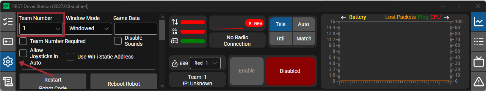

The DS should be set to your team number in order to connect to your robot. In order to do this click the Settings tab then enter your team number in the team number box. Press return or click outside the box for the setting to take effect.

PCs will typically have the correct network settings for the DS to connect to the robot already, but if not, make sure your Network adapter is set to :term:`DHCP`.

## Status Pane

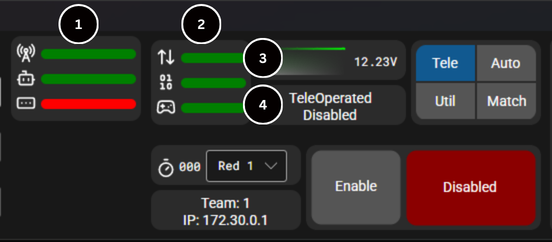

The Status Pane of the Driver Station is located in the center of the display and is always visible regardless of the tab selected. It displays a selection of critical information about the state of the DS and robot:

1. Status Indicators

   - The "FMS" indicates whether or not the DS is communicating with the FMS
   - The "DS" indicates whether the team number is set in the DS
   - The "Radio Ping" indicates whether or not the DS is communicating with the robot radio.
   - The "Robot Ping" indicates whether or not the DS is communicating with the robot
   - The "Connection Status (UDP/TCP)" indicates whether the DS is currently communicatingwith the MRC Communications Task on the Systemcore (it is split in half for the TCP and UDP communication)
   - The "Robot Code (Started/Running)" indicator shows whether the team Robot Code is currently running (determined by whether or not the Driver Station Task in the robot code is updating the battery voltage)
   - The "Gamepad Connection Status" indicator shows if at least one gamepad is plugged in and recognized by the DS

2. Battery Voltage - If the DS is connected and communicating with the robot, this displays current battery voltage
3. Status String - The Status String provides an overall status message indicating the state of the robot. Some examples are "No Robot Communication", "No Robot Code", "Emergency Stopped", and "TeleOperated Enabled". When the Systemcore brownout is triggered this will display "Voltage Brownout"

## Operation Tab

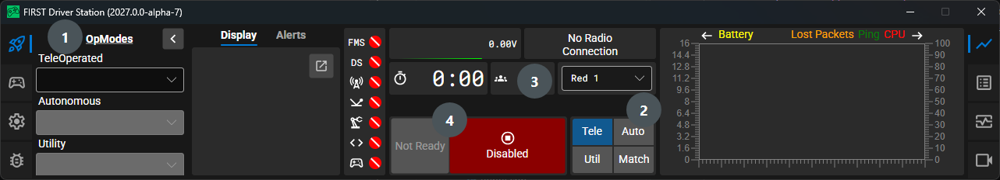

The Control Tab is used to control the mode of the robot and provide additional key status indicators while the robot is running.

1. OpMode (operational mode) - This section allows you to select an existing Op Mode to run during a specific match period.
2. Robot Mode - This section controls the Robot Mode.

   - Teleoperated Mode causes the robot to run the code in the Teleoperated portion of the match.
   - Autonomous Mode causes the robot to run the code in the Autonomous portion of the match.
   - Utility Mode is an additional mode where code that doesn't run in a regular match can be tested.
   - Match Mode (formerly called Practice Mode) causes the robot to cycle through the same transitions as an FRC match after the Enable button is pressed (timing for match mode can be found on the setup tab). When Match Mode is in use, the DS will flash the background orange to indicate a pending enable (either the start of Autonomous or the start of Teleop after an A-Stop).

3. Elapsed Time & Team Station - Indicates the amount of time the robot has been enabled, and when not connected to FMS, sets the team station to transmit to the robot.
4. Enable/Disable - These controls enable and disable the robot. See also :ref:`docs/software/firstdriverstation/first-driver-station-introduction:Driver Station Key Shortcuts`.

.. note:: When connected to the Field Management System the team station control in Section 3 will be greyed out.

## Gamepad Tab

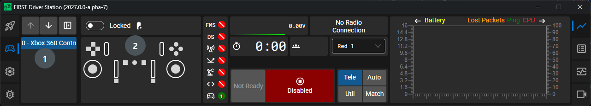

The Gamepad Tab includes information about all of the Gamepads connected to the DS.

1. Connected Devices - Shows the list of connected Gamepads/devices, there is an option to lock a device to a specific slot. The DS will save the slot assignment and use in future connections (this can be unreliable if the gamepad is not **uniquely identifiable**).
2. Gamepad Mapping - Built-in button mappings for common controllers using [SDL](https://www.libsdl.org/).

### Re-Arranging and Locking Devices

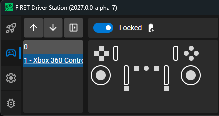

The Driver Station has the capability of "locking" a USB device into a specific slot. This is done automatically if the device is dragged to a new position and can also be triggered by checking the locked option. "Locked" devices will show up with an underline under the device. A locked device will reserve its slot even when the device is not connected to the computer (shown crossed out). Devices can be unlocked (and unconnected devices removed) by unchecking the locked box.

.. note:: If you have two or more of the same device, they should maintain their position as long as all devices remain plugged into the computer in the same ports they were locked in. If you switch the ports of two identical devices the lock should follow the port, not the device. If you re-arrange the ports (take one device and plug it into a new port instead of swapping) the behavior is not determinate (the devices may swap slots). If you unplug one or more of the set of devices, the positions of the others may move; they should return to the proper locked slots when all devices are reconnected.

## Settings Tab

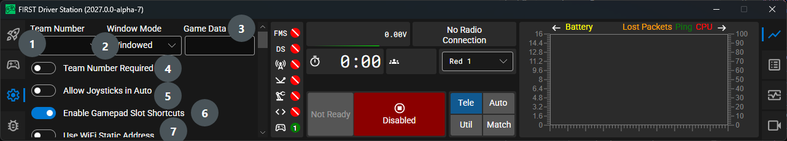

The Setup Tab contains a number of buttons teams can use to control the operation of the Driver Station:

1. :guilabel:`Team Number` - Should contain your FRC Team Number. This controls the mDNS name that the DS expects the robot to be at.
2. :guilabel:`Window Mode` - Controls how the DS window is displayed, either Windowed (floating window) or Docked (attached to the screen edge).
3. :guilabel:`Game Data` - This box can be used for at home testing of the Game Data API. Text entered into this box will appear in the Game Data API on the Robot Side. When connected to FMS, this data will be populated by the field automatically.
4. :guilabel:`Team Number Required` - When true, the DS requires a team number to be set before it will attempt to connect to the robot.
5. :guilabel:`Allow Joysticks in Auto` - When true, joystick input from the driver station is forwarded to the robot during the autonomous period.
6. :guilabel:`Enable Gamepad Slot Shortcuts` - When true, the DS allows the use of gamepad shortcuts to select gamepad slots. Holding Start + a Dpad direction for several seconds will select the corresponding gamepad slot. The Dpad directions correspond to the following slots:

   - Up = Slot 0
   - Right = Slot 1
   - Down = Slot 2
   - Left = Slot 3
7. :guilabel:`Use WiFi Static Address` - When true, the DS uses a static IP address for the WiFi interface when connecting to the robot, when unchecked, the DS uses the default network configuration.

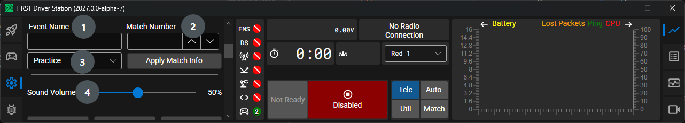

Match Information - This section allows you to set the match information for the current match. When connected to FMS, this information will be populated automatically.

1. :guilabel:`Event Name` - The name of the event, e.g. "FRC 2024 Week 1 Event"
2. :guilabel:`Match Number` - The number of the match, e.g. "1", "2", "3",
3. :guilabel:`Match Type` - The type of match, e.g. "Practice", "Qualification", "Elimination", or "Test" for at home testing.

4. :guilabel:`Sound Volume` - The volume of the DS sounds, from 0 to 100%.

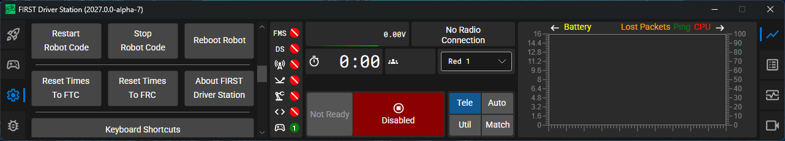

1. :guilabel:`Restart Robot Code` - This button attempts to restart the code running on the robot (but not restart the OS).
2. :guilabel:`Stop Robot Code` - This button attempts to stop the code running on the robot (but not restart the OS).
3. :guilabel:`Reboot Robot` - This button attempts to perform a remote reboot of the Systemcore (after clicking through a confirmation dialog).
4. :guilabel:`Reset Times To FTC` - This button resets the times to FTC.
5. :guilabel:`Reset Times To FRC` - This button resets the times to FRC.
6. :guilabel:`About FIRST Driver Station` - This button launches a window with information about the DS.
7. :guilabel:`Keyboard Shortcuts` - This button launches a window with information about the DS keyboard shortcuts.

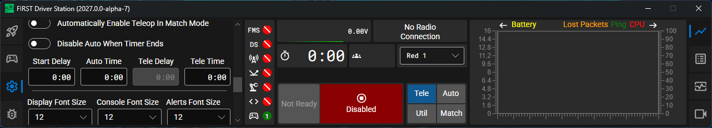

1. :guilabel:`Automatically Enable Teleop In Match Mode` - When true, match mode disables the robot at the end of autonomous for :guilabel:`Tele Delay` seconds, then automatically enables the robot for teleop. When false, the robot will remain disabled at the end of autonomous until the enable button is pressed.
2. :guilabel:`Disable Auto When Timer Ends` - When true, the robot will automatically disable at the end of autonomous. When false, the robot will remain enabled at the end of autonomous until the enable button is pressed.
3. Match Mode Timing - Set the duration of each match period.

  1. :guilabel:`Start Delay` - The delay before the match starts after the enable button is pressed.
  2. :guilabel:`Auto Time` - The duration of the autonomous period
  3. :guilabel:`Tele Delay` - The delay before the teleop period starts after the autonomous period ends.
  4. :guilabel:`Tele Time` - The duration of the teleop period

4. :guilabel:`Display Font Size` - The size of the font used in the DS
5. :guilabel:`Console Font Size` - The size of the font used in the DS console points.
6. :guilabel:`Alerts Font Size` - The size of the font used in the DS alerts

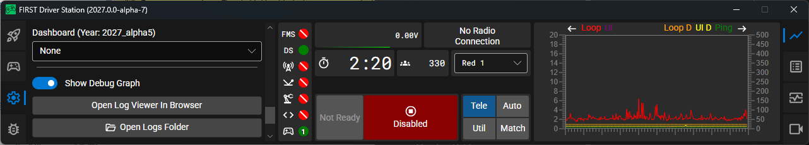

1. :guilabel:`Dashboard` - The dashboard application to launch alongside the DS, defaults to none.
2. :guilabel:`Show Debug Graph` - When true, the debug graph is visible on the Graph tab, showing debug info like loop times.
3. :guilabel:`Open Log Viewer In Browser` - Opens AdvantageScope Lite in a browser tab.
4. :guilabel:`Open Logs Folder` - Opens the folder where the DS logs are stored.

Addtionally, a link to the Driver Station web server and the API key needed for interacting with the DS web server are displayed in this section.

## Reporting Tab

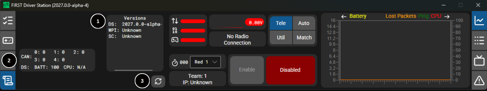

1. Versions - Shows versions of Drive Station, WPI, and Systemcore
2. Additional reporting information - Displays information about CAN devices.
3. :guilabel:`Renew DHCP Lease` - Renews DHCP lease and gets a new IP address.

## Graph Tab

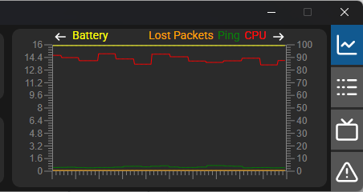

The Graph tab plots and displays advanced indicators of robot status to help teams diagnose robot issues:

1. The yellow line displays battery voltage.
2. The orange line displays lost packets.
3. The green line displays a graph of the ping.
4. The red line displays a graph of the CPU.

## Logs Tab

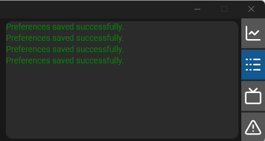

The Logs tab displays diagnostic messages from the DS, WPILib, User Code, and/or the Systemcore.

## Display Tab

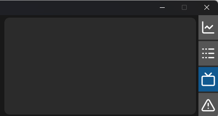

The DS Display tab.

## Alerts Tab

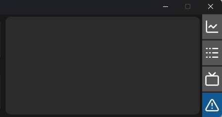

The Alerts tab displays any alert text.

.. todo:: Add more information about the Display and Alerts tab
