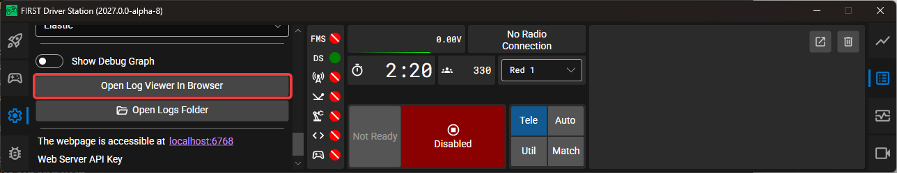
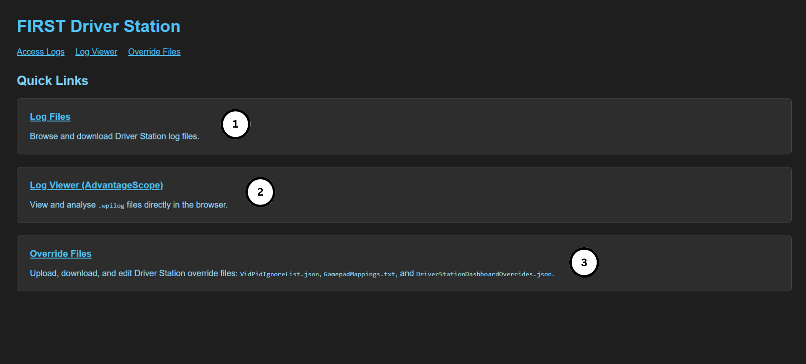
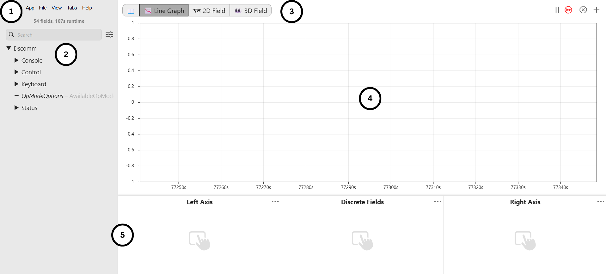
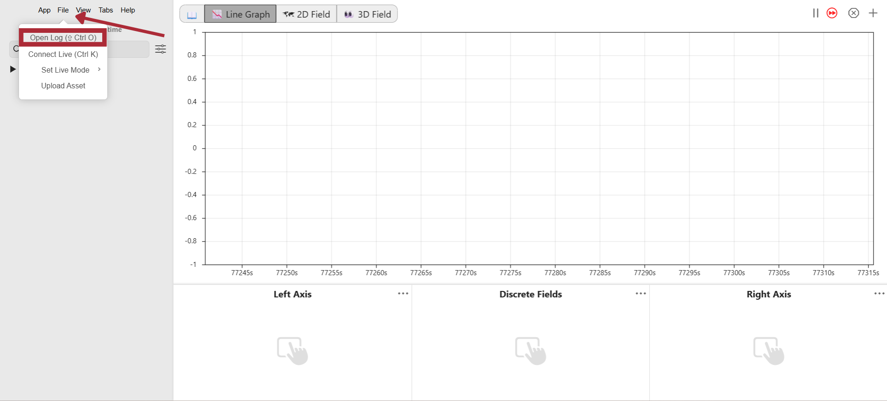
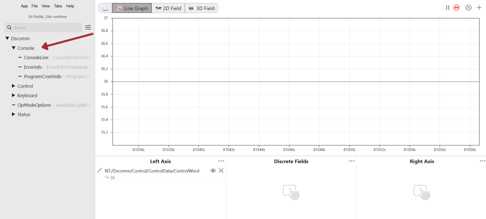

.. include:: <isonum.txt>

# Driver Station Log File Viewer

In an effort to provide information to aid in debugging, the FIRST Driver Station creates log files of important diagnostic data while running. These logs are saved as files with extension ``.wpilog`` and they can be reviewed later using AdvantageScope. You can launch AdvantageScope by navigating to ``http://localhost:6768/ascope`` or clicking the :guilabel:`Open Log Viewer` button in the settings tab (see below).

.. note:: Several alternative tools exist that provide similar functionality to the AdvantageScope Log Viewer. [DSLOG Reader](https://github.com/orangelight/DSLOG-Reader) is a third-party option. Note that WPILib offers no support for third-party projects.

## Event Logs

The  Driver Station logs all messages sent to the Logs tab into a new Log file. Log files are stored in the ``~/.firstds`` on unix platforms or ``PublicDocuments/FIRSTDriverStation/Logs`` on Windows. Each log has FIRST_DS in the file name with extension ``.wpilog``.

There is also a DS web server at ``http://localhost:6768`` that can be used to access log files. There are a few different helpful links on the home page:

1. Log Files - allows you to see and download DS log files.
2. Log Viewer (AdvantageScope) - launches the AdvantageScope web server.
3. Override Files - upload, download, and edit DS override files.

## AdvantageScope UI

The AdvantageScope contains a number of controls and displays to aid in the analysis of the Driver Station log files:

1.  Menus Bar - This is where you can learn about the AdvantageScope, upload or export files, create new tabs, etc.
2.  Sidebar - The sidebar lists the available tables and fields. You can also search for a field using the search box.
3.  Tab Bar - The tab bar allows you to switch between different views. The bookmark icon takes you to the documentation.
4.  Viewer Pane - This is where data is presented for each tab type.
5.  Control Pane - The control pane is where you select fields for visualization.

As shown above, you can open log files on AdvantageScope by clicking the file menu tab at the menu bar, and then clicking ``Open Log``. Alternatively, you can open logs by pressing :kbd:`Ctrl+O`.

.. note:: For more information about AdvantageScope, either navigate to the docs tab on AdvantageScope, or go to the docs page: :ref:`AdvantageScope <docs/software/dashboards/advantagescope:AdvantageScope>`

## Console fields

The Console fields offer information about errors, warnings, or robot program crashes:

- ConsoleLine - robot console output line with timestamp and sequence number.
- ErrorInfo - robot error or warning details with timestamps, sequence number, occurrence count, location, and call stack.
- ProgramCrashInfo - robot program crash details, location, call stack, and timestamp
