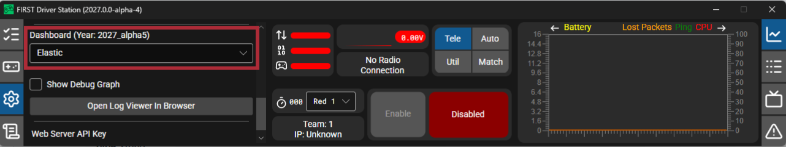

# Manually Setting the Driver Station to Start Custom Dashboard

.. note:: If WPILib is not installed to the default location (such as when files are copied to a PC manually), the dashboard of choice may not launch properly. To have the DS start a custom dashboard when it starts up, you have to manually modify the settings for the default dashboard.

.. warning:: This is not needed for most installations, try using the appropriate :ref:`Dashboard setting <docs/software/firstdriverstation/first-driver-station:Settings Tab>` for your language first.

## Selecting Driver Station Dashboard from Default Options



Open the FIRST Driver Station, click on the Settings tab, and select your desired available dashboard.

## Configuring Custom Dashboards

The FIRST Driver Station allows users to configure custom dashboards or change the default WPILib year used for dashboard lookups. These changes can be made in the ``DriverStationDashboardSettings.json``.

### File location

The configuration files are located at ``C:\Users\Public\Documents\FIRSTDriverStation\DriverStationDashboardSettings.json`` for Windows systems, or ``~/.firstds/DriverStationDashboardSettings.json`` for Unix systems. If this file does not already exist, you can create one yourself and place it in the correct DS configuration directory as mentioned previously.

.. note:: While DS is running, you can also access and change this file through the web server at ``http://localhost:6768/overrides.html```.

### Configuration

The configuration file has two top-level optional keys, ``CustomDashboard`` and ``DashboardYearOverrides``

```json
{
   "CustomDashboards": [
      { "Name": "CoolDash1", "Executable": "C:\\Dashboards\\CoolDash1.exe" },
      { "Name": "ExtraDash", "Executable": "C:\\Dashboards\\ExtraDash.exe" }
   ],
   "DashboardYearOverrides": [
      { "DashboardYearToOverride": "2027_alpha5", "DashboardOverrideYear": "2027_alpha6" }
   ]
}
```

#### CustomDashboards

The CustomDashboard key is an array of custom dashboards to add to the dashboard selector in the DS. Each entry has a ``Name`` field with the display name shown in the DS dashboard selector and an ``Executable`` field with the full path to the dashboard executable to launch.

#### DashboardYearOverrides

The DS defaults to looking for dashboard installed in the WPILib folder for the current year (e.g. ``C:\Users\Public\wpilib\2027``). ``DashboardYearOverrides`` allows you to change which year's WPILib folder the DS is looking for dashboards in. Each entry has two fields, ``DashboardYearToOverride`` which is the WPILib year string the DS would normally use, and ``DashboardOverrideYear`` which is the year string to use instead of the ``DashboardYearToOverride``.
