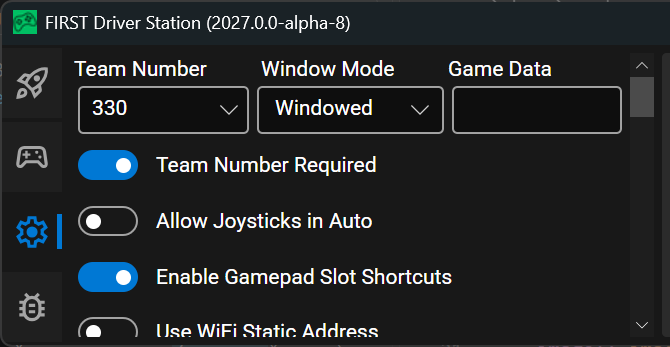

.. include:: <isonum.txt>

# 2026 Game Data Details

In the 2026 *FIRST*\ |reg| Robotics Competition game, the first goal to go inactive is determined by the alliance that scores more Fuel in Auto. The field will transmit the alliance to all 6 teams using Game Data. This page details the timing and structure of the sent data and provides examples of how to access it in the three supported programming languages.

## The Data

### Timing

Data is sent to both alliances simultaneously after Fuel scored in Auto is finished being assessed, approximately 3 seconds after the end of Auto. Between the beginning of the match and this point, the Game Data will be an empty string.

### Data format

The alliance will be provided as a single character representing the color of the alliance whose goal will go inactive first (i.e. 'R' = red, 'B' = blue). This alliance's goal will be active in Shifts 2 and 4.

## Testing Game Specific Data

You can test your Game Specific Data code without :term:`FMS` by using the Driver Station. Click on the Settings tab of the Driver Station, then enter the desired test string into the :guilabel:`Game Data` text field. The data will be transmitted to the robot in one of two conditions: Enable the robot in Teleop mode, or when the DS reaches the End Game time in a Practice Match (times are configurable on the Settings tab). It is recommended to run at least one match using the Practice functionality to verify that your code works correctly in a full match flow.



## Accessing the Data

The data is accessed using the Game Data methods in each language. Below are descriptions and examples of how to access the data from each of the three languages. As the data is provided to the Robot during the Teleop period, teams will likely want to query the data in Teleop periodic code.

### C++/Java/Python

In C++, Java, and Python the Game Data is accessed by using the ``GetGameData`` method of the MatchState class  ([Java](https://github.wpilib.org/allwpilib/docs/beta/java/org/wpilib/driverstation/MatchState.html), [C++](https://github.wpilib.org/allwpilib/docs/beta/cpp/classwpi_1_1_match_state.html), :py:class:`Python <robotpy:wpilib.MatchState>`). ``GetGameData`` returns an ``Optional`` type so Teams know that Game Data has been received. Teams likely want to query the data in a Teleop method such as Teleop Periodic in order to receive the data after it is sent during the match. Make sure to handle the case where the data has not been received.

.. tab-set-code::

  ```java
     Optional<String> gameData = MatchState.getGameData();
     if (gameData.isPresent() && gameData.get().length() > 0) {
       switch (gameData.get().charAt(0)) {
         case 'B':
           // Blue case code
           break;
         case 'R':
           // Red case code
           break;
         default:
           // This is corrupt data
           break;
       }
     } else {
       // Code for no data received yet
     }
  ```

  ```c++
     auto gameData = wpi::MatchState::GetGameData();
     if (gameData.has_value() && gameData->length() > 0) {
       switch (gameData->at(0)) {
         case 'B':
           // Blue case code
           break;
         case 'R':
           // Red case code
           break;
         default:
           // This is corrupt data
           break;
       }
     } else {
       // Code for no data received yet
     }
  ```

  ```python
        data = wpilib.MatchState.get_game_data()
        if data:
            match data:
                case "B":
                    # Blue case code
                    ...
                case "R":
                    # Red case code
                    ...
                case _:
                    # This is corrupt data
                    ...
        else:
            # Code for no data received yet
            ...
  ```

You can combine the Game Data with the current match time to determine whether your own alliance's hub is currently active. Note however the FMS doesn't send an official match time to robots, only an approximate match time.

For example:

.. tab-set-code::

  ```java
     public boolean isHubActive() {
       Optional<Alliance> alliance = MatchState.getAlliance();
       // If we have no alliance, we cannot be enabled, therefore no hub.
       if (alliance.isEmpty()) {
         return false;
       }
       // Hub is always enabled in autonomous.
       if (RobotState.isAutonomousEnabled()) {
         return true;
       }
       // At this point, if we're not teleop enabled, there is no hub.
       if (!RobotState.isTeleopEnabled()) {
         return false;
       }

       // We're teleop enabled, compute.
       double matchTime = MatchState.getMatchTime();
       Optional<String> gameData = MatchState.getGameData();
       // If we have no game data, we cannot compute, assume hub is active, as its
       // likely early in teleop
       if (!gameData.isPresent() || gameData.get().isEmpty()) {
         return true;
       }
       boolean redInactiveFirst = false;
       switch (gameData.get().charAt(0)) {
         case 'R' -> redInactiveFirst = true;
         case 'B' -> redInactiveFirst = false;
         default -> {
           // If we have invalid game data, assume hub is active.
           return true;
         }
       }

       // Shift was is active for blue if red won auto, or red if blue won auto.
       boolean shift1Active =
           switch (alliance.get()) {
             case Alliance.RED -> !redInactiveFirst;
             case Alliance.BLUE -> redInactiveFirst;
           };

       if (matchTime > 130) {
         // Transition shift, hub is active.
         return true;
       } else if (matchTime > 105) {
         // Shift 1
         return shift1Active;
       } else if (matchTime > 80) {
         // Shift 2
         return !shift1Active;
       } else if (matchTime > 55) {
         // Shift 3
         return shift1Active;
       } else if (matchTime > 30) {
         // Shift 4
         return !shift1Active;
       } else {
         // End game, hub always active.
         return true;
       }
     }
  ```

  ```c++
     bool IsHubActive() {
     auto alliance = wpi::MatchState::GetAlliance();
     if (!alliance.has_value()) {
       return false;
     }
     if (wpi::RobotState::IsAutonomousEnabled()) {
       return true;
     }
     if (!wpi::RobotState::IsTeleopEnabled()) {
       return false;
     }

     auto matchTime = wpi::MatchState::GetMatchTime().value();
     auto gameData = wpi::MatchState::GetGameData();
     if (!gameData.has_value() || gameData->empty()) {
       return true;
     }

     bool redInactiveFirst;
     switch ((*gameData)[0]) {
       case 'R':
         redInactiveFirst = true;
         break;
       case 'B':
         redInactiveFirst = false;
         break;
       default:
         return true;
     }

     bool shift1Active =
         *alliance == wpi::Alliance::RED ? !redInactiveFirst : redInactiveFirst;

     if (matchTime > 130) {
       return true;
     } else if (matchTime > 105) {
       return shift1Active;
     } else if (matchTime > 80) {
       return !shift1Active;
     } else if (matchTime > 55) {
       return shift1Active;
     } else if (matchTime > 30) {
       return !shift1Active;
     } else {
       return true;
     }
   }
  ```

  ```python
    def is_hub_active() -> bool:
        alliance = wpilib.MatchState.get_alliance()
        # If we have no alliance, we cannot be enabled, therefore no hub.
        if alliance is None:
            return False

        # Hub is always enabled in autonomous.
        if wpilib.RobotState.is_autonomous_enabled():
            return True

        # At this point if we're not teleop enabled, there is no hub.
        if not wpilib.RobotState.is_teleop_enabled():
            return False

        # We're teleop enabled, compute.
        match_time = wpilib.MatchState.get_match_time()
        game_data = wpilib.MatchState.get_game_data()

        match game_data:
            case "R":
                red_inactive_first = True
            case "B":
                red_inactive_first = False
            case _:
                # No or invalid game data, assume hub is active.
                return True

        # Shift 1 is active for blue if red won auto, or red if blue won auto.
        shift1_active = (
            not red_inactive_first
            if alliance == wpilib.Alliance.RED
            else red_inactive_first
        )

        if match_time > 130:
            return True  # Transition shift, hub is active
        elif match_time > 105:
            # Shift 1
            return shift1_active
        elif match_time > 80:
            # Shift 2
            return not shift1_active
        elif match_time > 55:
            # Shift 3
            return shift1_active
        elif match_time > 30:
            # Shift 4
            return not shift1_active
        else:
            return True  # End game, hub always active
  ```

