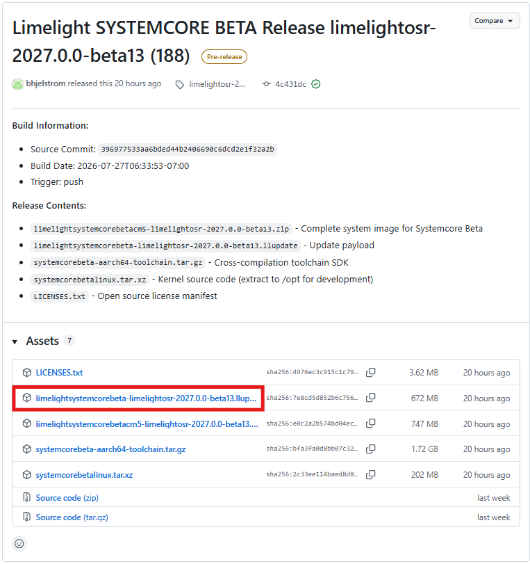
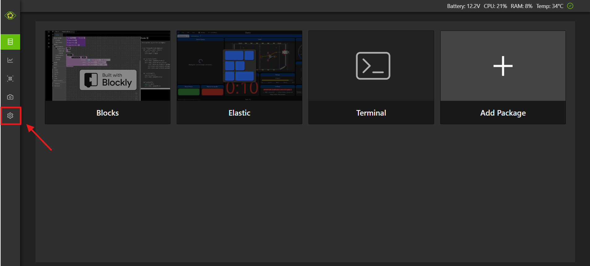
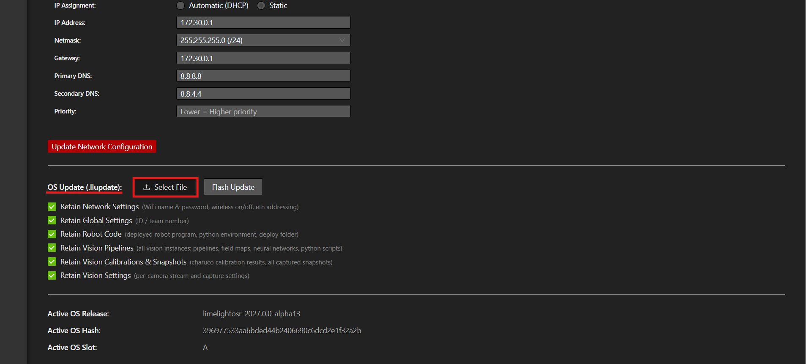

# Imaging your Systemcore

This page will show you how to image your Systemcore using a ``.llupdate`` file.

## Step 1: Downloading Update File

Navigate to the [Systemcore Releases Page](https://github.com/LimelightVision/systemcore-os-public/releases). Click the dropdown button next to assets and download the ``.llupdate`` file (as shown below).

.. note:: Make sure to download the alpha or beta update for the your Systemcore unit. If your Systemcore came unlabled, download the ``.llupdate`` file for an alpha unit, otherwise download the ``.llupdate`` for a beta unit.

## Step 2: Connect to Systemcore

Connect to your Systemcore via Wi-Fi or USB.

## Step 3: Flashing Systemcore

Go to your Systemcore home page (robot.local).

Navigate to the configure and update tab as shown above.

Scroll down to the OS Update section, click :guilabel:`Select File`, and select the ``.llupdate`` file you just downloaded. Then, click the :guilabel:`Flash Update` button and wait until the process finishes, it will take a few minutes.

.. note:: If you are connected to your Systemcore using Wi-Fi, you will need to reconnect to your Systemcore and refresh the page after it reboots (the last step of the flashing process).
